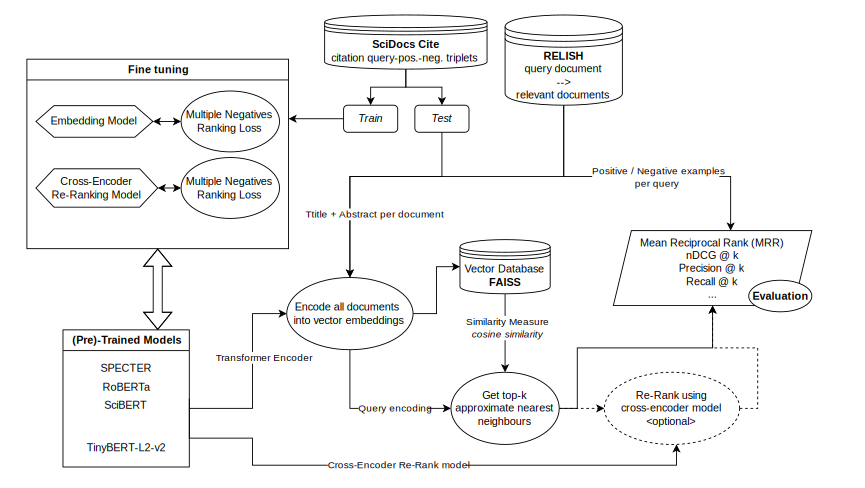

# Scientific Paper Recommender (Group 17)

  With the ever-growing amount of research papers being published, it becomes increasingly difficult for researchers to
  stay updated in their respective fields and discover relevant literature. To address this challenge, we propose the
  development and evaluation of a recommender system specifically designed to suggest relevant research papers based on
  abstract-style textual user queries. In particular, we aim to evaluate the performance of various pre-trained embedding
  models, fine-tuned variations and different retrieval techniques (such as the use of a separate model to re-rank
  approximate k-nearest neighbors) in the context of recommending research papers.
  
  Our overarching research question
  is:
  How well do different combinations of transformer-based
    embedding models and re-ranking models perform for research paper recommendation when evaluated on citation-based
    benchmarks?



## Project structure

This repository is organized as follows:
- `design_document/`: Contains the design document outlining the project plan, research questions, and methodology as required for the course.
- `figures/`: Contains visualizations and plots generated during the analysis and used in the report.
  - These figures can be easily reproduced using the `project/plotting.py` script.
- `models/`: Contains the fine-tuned models and scripts for training and evaluation.
  - Only the fine-tuned TinyBERT re-ranker is included due to size constraints.
  - The larger fine-tuned RoBERTa embedding model can be downloaded here and placed in the `models/` directory: [RoBERTa Model Download Link](https://drive.google.com/file/d/1nmuiRPrhe48vTCJPXCImzeL-y9S1d7Q5/view?usp=drive_link).
- `project/`: Contains the main codebase for data processing, model training, evaluation, and other utilities:
  - `/evaluation.pkl`: Contains the evaluation results on the full test sets for all model combinations and can be used to reproduce the figures in the report.
  - `/requirements.txt`: Lists the required Python packages to run the code.
  - `/cross_encoder_train.py`: Script for fine-tuning the re-ranker model.
  - `/fine_tune_embedding.py`: Script for fine-tuning the embedding model.
  - `/plotting.py`: Script for generating plots and visualizations from the evaluation results.
  - `/evaluate.py`: Script for evaluating the retrieval performance of different model combinations.
  - `/recomm_dataset.py`: Module for loading and processing the research paper dataset (does not need to be run).
  - `/latex_table_generator.py`: Utility script for generating LaTeX tables for the report.
- `report/`: Contains the final report and any supplementary materials.

## Experimental setup

### Retrieval pipeline

1. **Encoding**: All documents in the corpus are encoded using a transformer-based embedding model (e.g., SPECTER, SciBERT, RoBERTa). The title and abstract of each paper are concatenated with a `[SEP]` token to form the input representation.
2. **Indexing**: The generated document embeddings are stored in a FAISS index to enable efficient approximate nearest neighbor search.
3. **Retrieval**: For a given query, the top-k nearest documents are retrieved from the index based on cosine similarity with the query embedding.
4. **(Optional) Re-ranking**: If a re-ranking model is used, the top retrieved documents are re-scored based on their relevance to the query, and the final list is sorted by these new scores.

### Compared models

Based on the following embedding models and re-ranking models:
- **Embedding Models**:
  - [SPECTER](https://huggingface.co/sentence-transformers/allenai-specter)
  - [RoBERTa](https://huggingface.co/sentence-transformers/stsb-roberta-base-v2)
  - [SciBERT](https://huggingface.co/pritamdeka/S-Scibert-snli-multinli-stsb)
- **Re-Ranking Model**:
  - [TinyBERT-L2-v2](https://huggingface.co/cross-encoder/ms-marco-TinyBERT-L2-v2)

The following combinations of embedding models and re-ranking models were evaluated:

| Embedding Model        | Fine-tuned? | Re-Ranking Model         | Fine-tuned? |
|------------------------|-------------|--------------------------|--------------|
| SPECTER               | No          | -                        | -            |
| SPECTER               | No          | TinyBERT-L2-v2           | | No           |
| SPECTER               | No          | TinyBERT-L2-v2           | Yes          |
| RoBERTa                | No          | -                        | -            |
| RoBERTa                | No          | TinyBERT-L2-v2           | No           |
| RoBERTa                | No          | TinyBERT-L2-v2           | Yes          |
| RoBERTa                | Yes         | -                        | | -            |
| RoBERTa                | Yes         | TinyBERT-L2-v2           | No           |
| RoBERTa                | Yes         | TinyBERT-L2-v2           | Yes          |
| SciBERT                | No          | -                        | | -            |
| SciBERT                | No          | TinyBERT-L2-v2           | No           |
| SciBERT                | No          | TinyBERT-L2-v2           | Yes          |

### Fine-tuning details

- **Embedding fine-tuning**:
  - Fine-tuned RoBERTa model on the SciDocs citation triplet dataset using SentenceTransformers library.
  - **Loss function**: MultipleNegativesRankingLoss
  - **Batch size**: 40
  - **Learning rate warm-up**: 500 steps
  - **Weight decay**: 0.01
  - **Number of epochs**: 1
  - **16 bit precision**: Enabled
  - other hyperparameters were kept at their default values

- **Re-ranker fine-tuning**:
  - Fine-tuned TinyBERT-L2-v2 model on the SciDocs citation triplet dataset using the CrossEncoder class from the SentenceTransformers library.
  - **Loss function**:  MultipleNegativesRankingLoss
  - **Batch size**: 40
  - **Learning rate warm-up**: 500 steps
  - **Weight decay**: 0.01
  - **Number of epochs**: 1
  - **16 bit precision**: Enabled
  - other hyperparameters were kept at their default values.

### Metrics

All metrics are computed using query-based bootstrapping with 1000 resamples to obtain 90% confidence intervals.

Calculated metrics:
- **Success@(1,5,10,20)**: Proportion of queries for which at least one relevant document is found in the top-k retrieved documents.
- **Mean Reciprocal Rank (MRR)**: Average of the reciprocal ranks of the first relevant document for each query.
- **Normalized Discounted Cumulative Gain (nDCG) @(5,10)**: Measures the ranking quality of the retrieved documents, taking into account the position of relevant documents in the top k results.
- **Mean Average Precision (MAP)**: Mean of the average precision across all queries.
- **Recall@(5,10)**: Proportion of all relevant documents that are retrieved in the top-k results.
- **Precision@(5,10)**: Proportion of retrieved documents in the top-k results that are relevant.

## Datasets
- [**SciDocsCite**](https://huggingface.co/datasets/allenai/scirepeval/viewer/cite_prediction_new/): A dataset of citation triplets used for training and evaluation.
- [**RELISH**](https://huggingface.co/datasets/allenai/scirepeval/viewer/relish): Scientific papers with user-annotated relevance judgments for evaluation.

## Reproducing results
1.  **Environment Setup**: Install the required Python packages.
```bash
pip install -r project/requirements.txt
```

2.  **Training**: To fine-tune the models, use the provided scripts. Both scripts utilize the **SciDocsCite** citation triplets dataset for training with hyperparameters as specified above. **NOTE**: You might need to adjust the **BATCH_SIZE** depending on your GPU. This fine-tuning process can take several hours depending on your hardware.

  *   **Embedding Model**:
```bash
python project/fine_tune_embedding.py
```
  *   **Cross-Encoder (Re-ranker)**:
```bash
python project/cross_encoder_train.py
```

3.  **Evaluation**: Run the evaluation pipeline across all model combinations on the **RELISH** and SciRepEval validation sets. **NOTE**: This process can also take several hours depending on your hardware.
```bash
python project/evaluate.py
```

  This script evaluates the above model combinations and saves the results in `project/evaluation.pkl`, which can be used to reproduce the figures in the report.
  
4.  **Visualization**: Reproduce the figures found in the report.
```bash
python project/plotting.py
```
